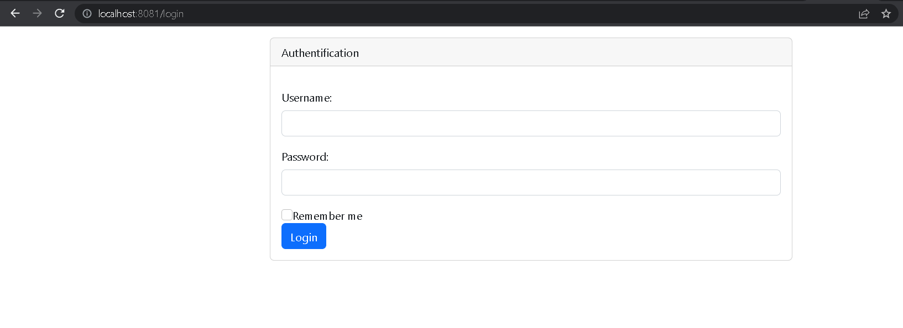

<h1>
Patient App "MVC & Spring Security"</h1>

 
<h4>1 - Login page</h4>

 
<h4>SecurityConfig.java</h4>

 
<h4>SecurityController.java</h4>

 
<h4>2 - Main page containing list of patients (ADMIN ACCOUNT)</h4>

 
<h4>patients.html</h4>

 

 
<h4>3 - Deleting patient</h4>

 
<h4>4 - Main page containing list of patients (USER ACCOUNT)</h4>

 
<h4>notAuthorized page</h4>

 
<h4>notAuthorized.html</h4>

